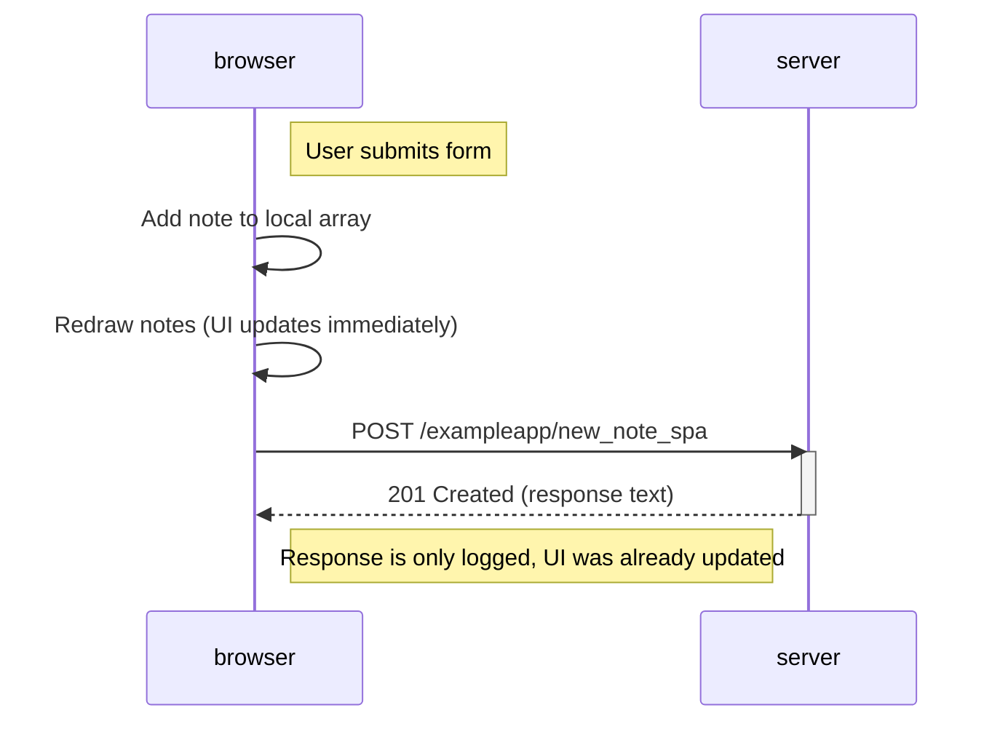

```mermaid
sequenceDiagram
    participant browser
    participant server

    Note right of browser: User submits form

    browser->>browser: Add note to local array
    browser->>browser: Redraw notes (UI updates immediately)

    browser->>server: POST /exampleapp/new_note_spa
    activate server
    server-->>browser: 201 Created (response text)
    deactivate server

    Note right of browser: Response is only logged, UI was already updated
```